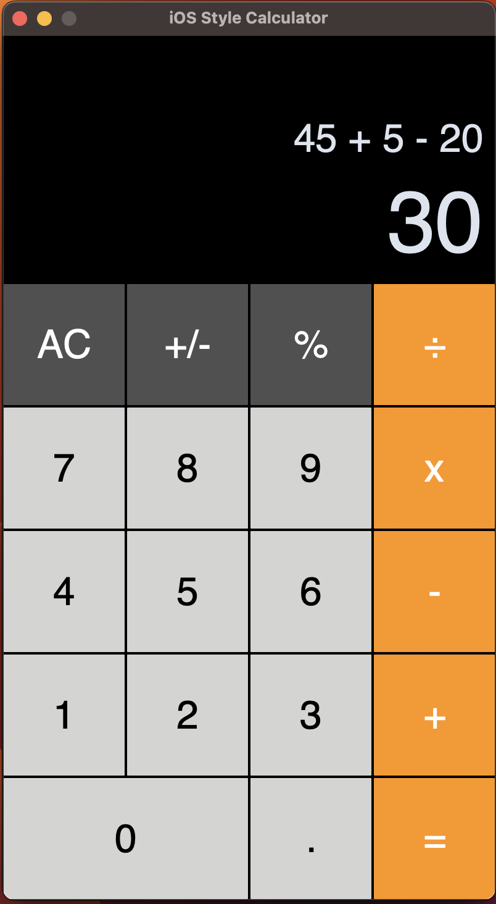

# iOS Style Calculator

This project is an iOS-style calculator built using Python and the `customtkinter` library, offering both light and dark modes based on system settings.

## Features

- **Basic Math Functions**: Addition, subtraction, multiplication, division, and percentage.
- **Appearance Mode**: Automatically switches between light and dark mode based on system settings (using `darkdetect`).
- **Custom UI**: Styled buttons with custom colors, fonts, and rounded corners for an iOS-like experience.

## Requirements

To run the calculator, you need the following libraries:

- `customtkinter`: For building a modern UI.
- `darkdetect`: For detecting the system's dark mode status.
- `ctypes`: For interacting with low-level system calls (used for setting the title bar color on Windows).

Install the required dependencies using:

```bash
pip install customtkinter darkdetect
```

## Files

- **`calculator.py`**: The main file containing the `Calculator` class that handles the UI and logic of the calculator.
- **`buttons.py`**: A custom button class extending `CTkButton`, used for creating calculator buttons with specific styles and functionality.
- **`settings.py`**: Stores configurations such as app size, fonts, button layouts, and colors.

## How to Run

1. Clone this repository.
2. Install the required Python libraries (`customtkinter`, `darkdetect`).
3. Run the `calculator.py` file:

```bash
python calculator.py
```

## Usage

- **Basic Operations**: Use the number buttons to input values and the operation buttons (÷, x, +, -) for calculations.
- **Clear**: Press "AC" to clear all values.
- **Invert**: Press "+/-" to toggle the sign of the current number.
- **Percentage**: Press "%" to calculate the percentage of the current number.

## Example Screenshot



## Future Improvements

- **Additional Features**: Implement scientific functions like square root, exponentiation, and memory functions.
- **Cross-platform Title Bar Customization**: Improve title bar customization for macOS and Linux.
```

This content is ready to be saved as `README.md`. It gives a complete overview of the project, including its features, how to set it up, and how to use it. You can add a screenshot where indicated if you want a visual example in the README.